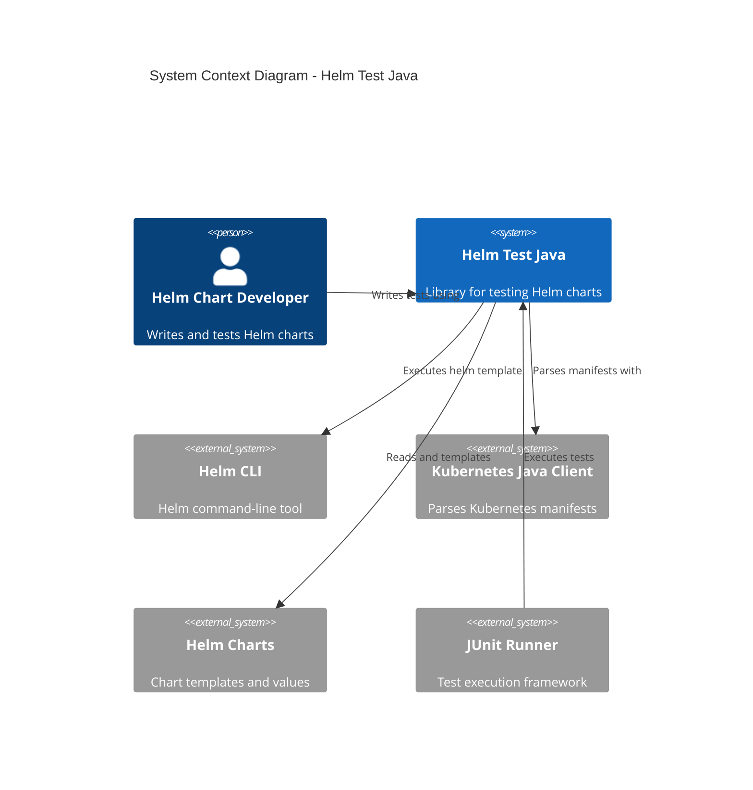
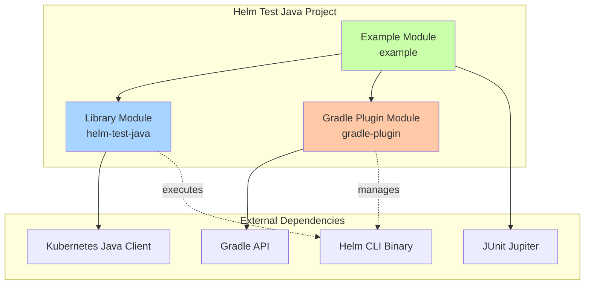
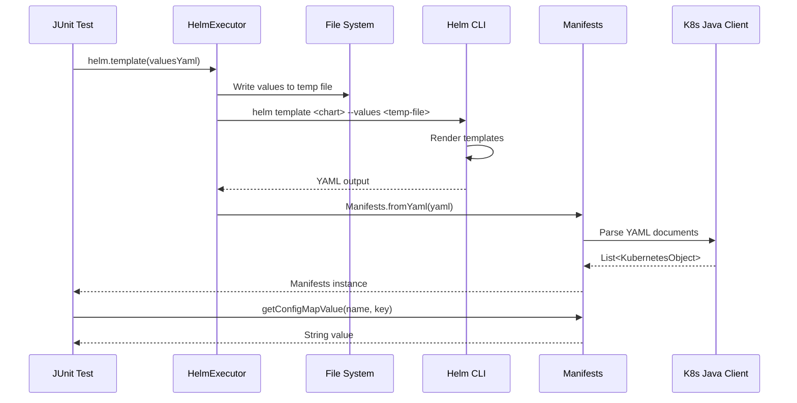
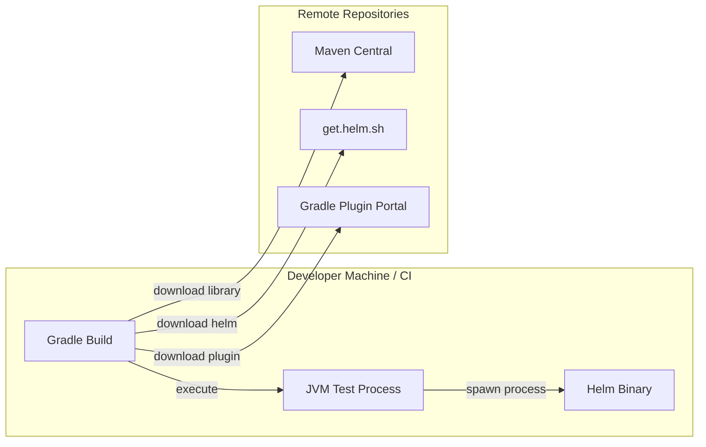

# Helm Test Java - Architecture Documentation

## Overview

Helm Test Java is a Java library and Gradle plugin that enables developers to write automated tests for Helm charts. The project provides a test-driven development workflow for Helm chart development, allowing developers to test chart rendering behavior and validate Kubernetes manifests programmatically.

## System Context



### Key Stakeholders

- **Helm Chart Developers**: Primary users who write automated tests for Helm charts
- **DevOps Engineers**: Use the library to validate chart configurations across environments
- **CI/CD Pipelines**: Automated testing of chart changes before deployment

### External Systems

| System | Purpose | Interaction |
|--------|---------|-------------|
| Helm CLI | Chart templating engine | Process execution via `helm template` command |
| Kubernetes Java Client | Manifest parsing | Deserializes YAML into typed Kubernetes objects |
| Helm Charts | Test subjects | Chart directories containing templates and values |
| JUnit | Test framework | Executes tests using HelmExecutor |
| Gradle | Build system | Plugin manages Helm toolchain |

## Module Architecture

The project consists of three main modules:



### Module Descriptions

#### Library Module (`library/`)
- **Purpose**: Core testing API for Helm charts
- **Key Classes**: `HelmExecutor`, `Manifests`
- **Published As**: `com.rrmoore:helm-test-java:1.0` on Maven Central
- **Dependencies**: Kubernetes Java Client 25.0.0

#### Gradle Plugin Module (`gradle/plugins/gradle-plugin/`)
- **Purpose**: Manages Helm executable toolchain
- **Key Classes**: `HelmTestJavaPlugin`, `HelmToolchainExtension`
- **Published As**: `com.rrmoore.gradle.helm-test-java` on Gradle Plugin Portal
- **Responsibilities**:
  - Downloads Helm binaries from official repository
  - Configures test tasks with Helm executable path
  - Supports manual Helm executable specification

#### Example Module (`example/`)
- **Purpose**: Demonstrates library usage patterns
- **Contains**: Sample Helm chart (`gym-register`) with tests
- **Not Published**: Development and documentation only

## System Boundaries

### What the System Does
- Executes `helm template` commands programmatically
- Parses rendered Kubernetes manifests into typed objects
- Provides fluent API for asserting manifest properties
- Manages Helm executable versions per project
- Supports multiple values file combinations

### What the System Does NOT Do
- Does not deploy to Kubernetes clusters
- Does not perform actual Helm installs or upgrades
- Does not validate chart syntax (delegates to Helm CLI)
- Does not manage Kubernetes cluster connections
- Does not perform runtime testing of deployed applications

## Data Flow



### Data Processing Steps

1. **Test Initialization**: Test creates HelmExecutor with chart directory path
2. **Values Preparation**: Values YAML strings written to timestamped temp files
3. **Process Execution**: Helm CLI invoked with template command and values files
4. **Output Capture**: Process stdout/stderr captured with 10-second timeout
5. **YAML Parsing**: Output split on `---` and each document parsed
6. **Object Deserialization**: Kubernetes Java Client deserializes to typed objects
7. **Test Assertions**: Test queries Manifests for specific resources and values

## Key Architectural Patterns

### Facade Pattern
`HelmExecutor` provides a simplified interface to Helm CLI complexity:
- Hides process management
- Handles file I/O
- Manages error handling
- Abstracts platform differences

### Value Object Pattern
`Manifests` encapsulates rendered Kubernetes objects:
- Immutable after creation
- Provides type-safe accessors
- Encapsulates query logic
- Self-validating

### Provider Pattern (Gradle Plugin)
`HelmToolchainExtension` uses Gradle's lazy configuration:
- Defers dependency resolution
- Supports property conventions
- Enables flexible configuration
- Integrates with Gradle lifecycle

### Template Method Pattern
Test methods follow consistent pattern:
```java
// 1. Setup values
var values = "...yaml...";

// 2. Execute templating
var manifests = helm.template(values);

// 3. Assert results
assertEquals(expected, manifests.getConfigMapValue(name, key));
```

## Technology Stack

| Layer | Technology | Version | Purpose |
|-------|-----------|---------|---------|
| Language | Java | 25 | Core implementation |
| Build Tool | Gradle | 8+ | Build and dependency management |
| Testing | JUnit Jupiter | 5+ | Test framework |
| K8s Models | Kubernetes Java Client | 25.0.0 | Manifest parsing |
| Plugin Dev | Gradle API | 8+ | Plugin implementation |
| Language (Plugin) | Kotlin | Latest | Plugin implementation |

## Integration Points

### Helm CLI Integration
- **Protocol**: Process execution via `ProcessBuilder`
- **Commands Used**: `helm version`, `helm template`
- **Timeout**: 10 seconds per command
- **Error Handling**: Exit code validation, stderr capture

### Kubernetes Java Client Integration
- **Purpose**: YAML to POJO deserialization
- **Classes Used**: Model classes (V1Deployment, V1ConfigMap, etc.)
- **API**: `Yaml.load()` for parsing individual documents

### Gradle Integration
- **Extension Point**: `helmToolchain` project extension
- **Task Configuration**: Hooks into all `Test` tasks
- **Dependency Management**: Ivy repository for Helm binaries
- **System Properties**: `com.rrmoore.helm.test.executable.path`

## Deployment Architecture

The library does not deploy services. It is consumed as:

1. **Maven Dependency**: Added to `testImplementation` configuration
2. **Gradle Plugin**: Applied to build scripts
3. **Runtime Execution**: Runs in JVM during test phase



## Next Steps

For detailed implementation information, see:
- [Component Architecture](./COMPONENTS.md) - Internal class structure
- [Data Architecture](./DATA.md) - Data models and flow
- [Security Architecture](./SECURITY.md) - Security considerations
- [Quality Attributes](./QUALITY.md) - Performance, reliability, maintainability
- [Architecture Decision Records](./adr/) - Historical design decisions
∏