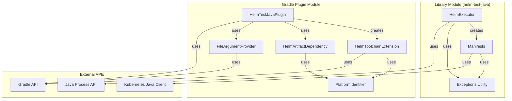
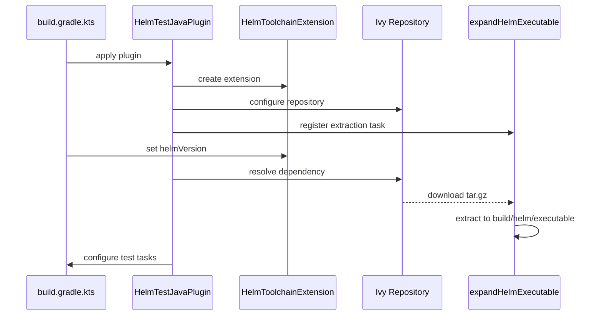
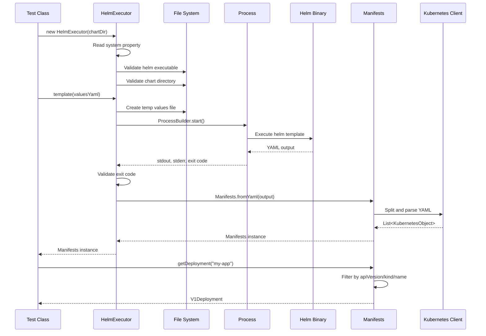
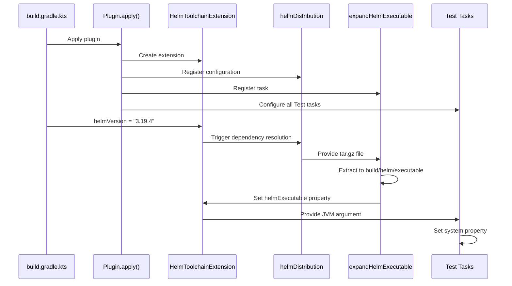

# Component Architecture

## Component Overview



## Library Module Components

### HelmExecutor

**File**: [library/src/main/java/com/rrmoore/helm/test/HelmExecutor.java](../../library/src/main/java/com/rrmoore/helm/test/HelmExecutor.java)

**Purpose**: Primary interface for executing Helm commands and obtaining rendered manifests.

**Responsibilities**:
- Locate Helm executable (from system property or explicit path)
- Validate Helm executable and chart directory
- Execute `helm template` with various value combinations
- Manage temporary values files with unique timestamps
- Capture process output and error streams
- Parse rendered YAML into Manifests objects
- Handle expected failures (templateError methods)

**Key Methods**:
```java
// Constructors
HelmExecutor(File chart)  // Uses system property for helm path
HelmExecutor(File helmExecutable, File chart)  // Explicit helm path

// Execution methods
Manifests template()  // No custom values
Manifests template(String valuesYaml)  // Single values file
Manifests template(List<String> valuesYamls)  // Multiple values files
String templateError(String valuesYaml)  // Expected failure
String templateError(List<String> valuesYamls)  // Expected failure
String version()  // Get helm version
```

**Design Patterns**:
- **Facade**: Simplifies Helm CLI interaction
- **Factory**: Creates Manifests from YAML output
- **Builder**: Constructs command arguments incrementally

**Error Handling**:
- Validates executable file existence and permissions
- Validates chart directory existence
- 10-second timeout per command execution
- Captures stderr for failure diagnostics
- Throws RuntimeException for unexpected success/failure

**State Management**:
- Immutable configuration (helm executable, chart path)
- Timestamp-based temp file naming prevents collisions
- No shared mutable state between tests

### Manifests

**File**: [library/src/main/java/com/rrmoore/helm/test/Manifests.java](../../library/src/main/java/com/rrmoore/helm/test/Manifests.java)

**Purpose**: Represents parsed Kubernetes manifests with type-safe accessors.

**Responsibilities**:
- Parse multi-document YAML into Kubernetes objects
- Provide generic query interface (findAll, findOne, getOne)
- Provide type-safe accessors for common resource types
- Extract nested values from ConfigMaps and Secrets
- Validate query results (existence, uniqueness)

**Key Methods**:
```java
// Factory methods
static Manifests fromYaml(String yaml)
static Manifests fromYaml(Path path)

// Generic query methods
List<KubernetesObject> findAll(Predicate<KubernetesObject> predicate)
Optional<KubernetesObject> findOne(Predicate<KubernetesObject> predicate)
KubernetesObject getOne(Predicate<KubernetesObject> predicate)
KubernetesObject getOne(String apiVersion, String kind, String name)
<T> T getOne(String apiVersion, String kind, String name, Class<T> clazz)

// Typed resource accessors
V1Deployment getDeployment(String name)
V1StatefulSet getStatefulSet(String name)
V1Job getJob(String name)
V1Service getService(String name)
V1ConfigMap getConfigMap(String name)
V1Secret getSecret(String name)
// ... and more

// Value extraction
String getConfigMapValue(String configMapName, String dataKey)
String getSecretValue(String secretName, String dataKey)
```

**Design Patterns**:
- **Value Object**: Immutable collection of objects
- **Query Object**: Flexible manifest querying
- **Decorator Pattern**: Users can extend for custom accessors

**Extensibility**:
The class documentation explicitly encourages decoration:
```java
/**
 * You should create a decorator for this class which encapsulates
 * specific information about the Helm chart you're testing.
 * In your decorator, you can add methods to get different kinds of
 * rendered Kubernetes objects, which are not covered exhaustively in this class.
 */
```

**Example Decorator**:
```java
public class GymRegisterManifests extends Manifests {
    public GymRegisterManifests(List<KubernetesObject> objects) {
        super(objects);
    }

    public V1Deployment getAppDeployment() {
        return getDeployment("gym-register-app");
    }

    public V1Deployment getDatabaseDeployment() {
        return getDeployment("gym-register-database");
    }
}
```

### Exceptions Utility

**File**: [library/src/main/java/com/rrmoore/helm/test/jdkext/Exceptions.java](../../library/src/main/java/com/rrmoore/helm/test/jdkext/Exceptions.java)

**Purpose**: Utility for converting checked exceptions to unchecked.

**Responsibilities**:
- Wrap checked exception-throwing operations
- Rethrow as RuntimeException
- Simplify lambda expressions in streams

**Usage Pattern**:
```java
Exceptions.uncheck(() -> Files.writeString(path, content));
```

## Gradle Plugin Components

### HelmTestJavaPlugin

**File**: [gradle/plugins/gradle-plugin/src/main/kotlin/com/rrmoore/gradle/helm/test/HelmTestJavaPlugin.kt](../../gradle/plugins/gradle-plugin/src/main/kotlin/com/rrmoore/gradle/helm/test/HelmTestJavaPlugin.kt)

**Purpose**: Gradle plugin entry point for Helm toolchain management.

**Responsibilities**:
- Create `helmToolchain` project extension
- Configure Ivy repository for Helm artifacts
- Create `helmDistribution` dependency configuration
- Register `expandHelmExecutable` task
- Configure all Test tasks with helm executable path
- Provide system property to library code

**Plugin Application Flow**:


**Configuration Points**:
```kotlin
helmToolchain {
    helmVersion = "3.19.4"  // Download from internet
    // OR
    helmExecutable = File("/path/to/helm")  // Use local binary
    // AND optionally
    helmPlatform = PlatformIdentifier.LINUX_AMD64  // Override detection
}
```

### HelmToolchainExtension

**File**: [gradle/plugins/gradle-plugin/src/main/kotlin/com/rrmoore/gradle/helm/test/HelmToolchainExtension.kt](../../gradle/plugins/gradle-plugin/src/main/kotlin/com/rrmoore/gradle/helm/test/HelmToolchainExtension.kt)

**Purpose**: DSL for configuring Helm toolchain.

**Properties**:
```kotlin
val helmVersion: Property<String>  // Version to download
val helmExecutable: Property<File>  // Path to executable
val platformIdentifier: Property<PlatformIdentifier>  // OS/arch
```

**Platform Detection**:
- Reads `os.name` and `os.arch` system properties
- Maps to PlatformIdentifier enum values
- Supports manual override for edge cases

**Detection Logic**:
```kotlin
// OS Detection
"mac" in osName -> DARWIN
"windows" in osName -> WINDOWS
else -> LINUX

// Architecture Detection
osArch in ["x86_64", "amd64"] -> AMD64
else -> ARM64
```

### PlatformIdentifier

**File**: [gradle/plugins/gradle-plugin/src/main/kotlin/com/rrmoore/gradle/helm/test/PlatformIdentifier.kt](../../gradle/plugins/gradle-plugin/src/main/kotlin/com/rrmoore/gradle/helm/test/PlatformIdentifier.kt)

**Purpose**: Enum representing supported Helm binary platforms.

**Values**:
- `DARWIN_AMD64` - macOS Intel
- `DARWIN_ARM64` - macOS Apple Silicon
- `LINUX_AMD64` - Linux x86_64
- `LINUX_ARM64` - Linux ARM
- `WINDOWS_AMD64` - Windows x86_64
- `WINDOWS_ARM64` - Windows ARM

**Usage**: Maps to Helm's official binary naming convention.

### HelmArtifactDependency

**File**: [gradle/plugins/gradle-plugin/src/main/kotlin/com/rrmoore/gradle/helm/test/HelmArtifactDependency.kt](../../gradle/plugins/gradle-plugin/src/main/kotlin/com/rrmoore/gradle/helm/test/HelmArtifactDependency.kt)

**Purpose**: Constructs Gradle dependency coordinates for Helm binaries.

**Coordinate Format**:
```
io.github.helm:helm:${version}:${platform}@tar.gz
```

**Example**:
```
io.github.helm:helm:3.19.4:darwin-arm64@tar.gz
```

### FileArgumentProvider

**File**: [gradle/plugins/gradle-plugin/src/main/kotlin/com/rrmoore/gradle/helm/test/FileArgumentProvider.kt](../../gradle/plugins/gradle-plugin/src/main/kotlin/com/rrmoore/gradle/helm/test/FileArgumentProvider.kt)

**Purpose**: Provides JVM arguments to test tasks.

**Functionality**:
- Implements Gradle's `CommandLineArgumentProvider`
- Converts property name and file path to `-D` argument
- Ensures test tasks receive helm executable path

**Generated Argument**:
```
-Dcom.rrmoore.helm.test.executable.path=/path/to/helm
```

## Component Interactions

### Typical Test Execution Flow



### Gradle Plugin Configuration Flow



## Package Structure

### Library Module
```
com.rrmoore.helm.test
├── HelmExecutor.java          Main executor class
├── Manifests.java             Manifest query API
└── jdkext
    └── Exceptions.java        Exception utilities
```

### Gradle Plugin Module
```
com.rrmoore.gradle.helm.test
├── HelmTestJavaPlugin.kt      Plugin entry point
├── HelmToolchainExtension.kt  Configuration DSL
├── PlatformIdentifier.kt      Platform enum
├── HelmArtifactDependency.kt  Dependency coordinates
└── FileArgumentProvider.kt    JVM argument provider
```

## Testability

### Library Testing
- Tests use actual Helm binary
- Test resources include sample chart (`my-app`)
- Tests verify parsing of all common Kubernetes types
- Tests verify error handling for invalid inputs

### Plugin Testing
- Plugin functional testing uses Gradle TestKit
- Tests verify Helm download and extraction
- Tests verify test task configuration
- Tests verify system property propagation

## Extension Points

### For Library Users

1. **Custom Manifests Decorators**:
   ```java
   public class MyChartManifests extends Manifests {
       // Add chart-specific accessors
   }
   ```

2. **Custom HelmExecutor Configuration**:
   ```java
   public class MyHelmExecutor extends HelmExecutor {
       // Add custom command variations
   }
   ```

### For Plugin Users

1. **Custom Platform Detection**:
   ```kotlin
   helmToolchain {
       platformIdentifier = customPlatformDetection()
   }
   ```

2. **Custom Helm Repository**:
   ```kotlin
   repositories {
       ivy {
           url = uri("https://my-helm-mirror.example.com")
       }
   }
   ```
