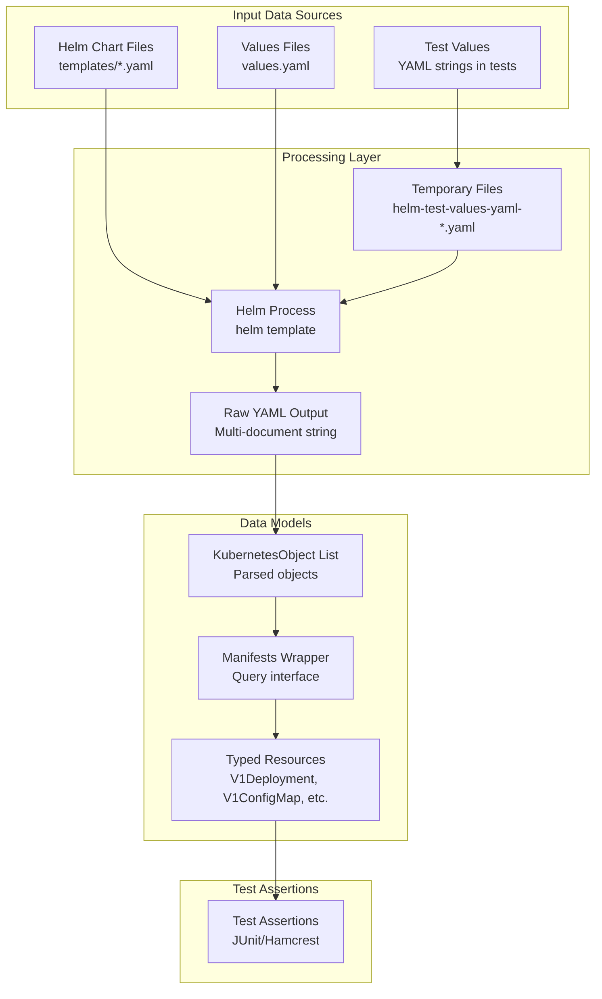
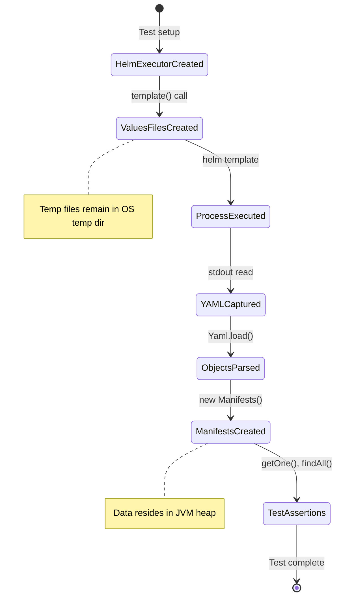

# Data Architecture

## Overview

Helm Test Java operates primarily on transient data during test execution. There is no persistent data storage. Data flows from Helm charts through the Helm CLI into parsed Kubernetes object models.

## Data Flow Architecture



## Data Models

### Core Data Types

#### 1. Chart Files (Input)
**Format**: YAML templates with Go templating syntax

**Structure**:
```yaml
# example: templates/deployment.yaml
apiVersion: apps/v1
kind: Deployment
metadata:
  name: {{ .Values.name }}
spec:
  replicas: {{ .Values.replicas }}
  # ... more template logic
```

**Characteristics**:
- Read-only during test execution
- Contains Go template directives
- Organized in `templates/` directory
- Accompanied by `Chart.yaml` and `values.yaml`

#### 2. Values YAML (Input)
**Format**: Plain YAML data

**Structure**:
```yaml
# User-provided values in tests
app:
  name: my-application
  replicas: 3
  image:
    repository: nginx
    tag: "1.21"
```

**Characteristics**:
- Provided as strings in test methods
- Can be multiple files (merged by Helm)
- Temporary file lifecycle managed by HelmExecutor
- Files named with timestamp to prevent collisions

**Temporary File Naming**:
```
helm-test-values-yaml-{timestamp}-{random}.yaml
```

Example: `helm-test-values-yaml-20250120173045-a8f9d3b2.yaml`

#### 3. Raw YAML Output (Intermediate)
**Format**: Multi-document YAML string

**Structure**:
```yaml
---
apiVersion: v1
kind: ConfigMap
metadata:
  name: app-config
data:
  key: value
---
apiVersion: apps/v1
kind: Deployment
metadata:
  name: my-app
spec:
  replicas: 3
# ... more documents
```

**Characteristics**:
- Output from `helm template` command
- Documents separated by `---`
- First `---` separator skipped during parsing
- Entire output captured in memory

#### 4. KubernetesObject (Model)
**Type**: Interface from Kubernetes Java Client

**Key Properties**:
- `apiVersion: String` - Resource API version
- `kind: String` - Resource type
- `metadata: V1ObjectMeta` - Resource metadata
  - `name: String` - Resource name
  - `namespace: String` - Kubernetes namespace
  - `labels: Map<String, String>` - Resource labels
  - `annotations: Map<String, String>` - Resource annotations

**Hierarchy**:
```
KubernetesObject (interface)
├── V1Deployment
├── V1StatefulSet
├── V1Service
├── V1ConfigMap
├── V1Secret
├── V1ServiceAccount
├── V1PersistentVolumeClaim
├── V1Ingress
└── V1Job
```

#### 5. Manifests (Wrapper)
**Type**: Custom value object

**Internal Data**:
```java
private final List<KubernetesObject> renderedObjects;
```

**Characteristics**:
- Immutable after construction
- Stores all rendered objects from a single template execution
- Provides query methods for accessing specific resources
- No persistence or serialization

### Data Transformations

```mermaid
flowchart LR
    A[String<br/>valuesYaml] -->|writeString| B[File<br/>temp file]
    B -->|--values arg| C[Process<br/>helm template]
    C -->|stdout| D[String<br/>raw YAML]
    D -->|split on ---| E[String[]<br/>documents]
    E -->|Yaml.load| F[KubernetesObject[]<br/>parsed objects]
    F -->|new Manifests| G[Manifests<br/>wrapper]
    G -->|getOne/findAll| H[KubernetesObject<br/>specific resource]
    H -->|cast| I[V1Deployment<br/>typed resource]
```

## Data Storage

### Temporary File Management

**Location**: System temp directory (determined by JVM)

**Lifecycle**:
1. **Creation**: Before `helm template` execution
2. **Usage**: Passed to Helm via `--values` flag
3. **Retention**: Not explicitly deleted (relies on OS cleanup)

**Naming Convention**:
```java
File.createTempFile("helm-test-values-yaml-{timestamp}-", ".yaml")
```

**Collision Prevention**:
- Timestamp prefix (`yyyyMMddHHmmss`) from HelmExecutor initialization
- Random suffix generated by `File.createTempFile`

**Cleanup Strategy**:
- No explicit cleanup in library code
- Relies on operating system temp file cleanup
- Short-lived (test execution duration)

### Error Output Storage

**Unexpected Success Case**:
When `templateError()` unexpectedly succeeds, manifests saved to file:

```java
var unexpectedManifests = File.createTempFile(
    "helm-test-unexpected-success-{timestamp}-",
    ".yaml"
);
Files.writeString(unexpectedManifests.toPath(), stdout);
```

**Purpose**: Debugging unexpected test behavior

## Data Validation

### Input Validation

**HelmExecutor Constructor**:
```java
if (!helmExecutable.isFile()) {
    throw new IllegalArgumentException("Helm executable file does not exist.");
}
if (!helmExecutable.canExecute()) {
    throw new IllegalArgumentException("Helm executable file is not executable.");
}
if (!chart.exists()) {
    throw new IllegalArgumentException("Helm chart does not exist.");
}
```

**System Property Validation**:
```java
Objects.requireNonNull(
    System.getProperty("com.rrmoore.helm.test.executable.path"),
    "Missing system property..."
);
```

### Output Validation

**Process Exit Code**:
```java
if (exitCode != 0 && expectSuccess) {
    throw new RuntimeException("Command finished with exit code " + exitCode);
}
if (exitCode == 0 && !expectSuccess) {
    throw new RuntimeException("Command unexpectedly finished with exit code 0");
}
```

**Manifest Query Validation**:
```java
// findOne() - max 1 result
if (objects.size() > 1) {
    throw new IllegalArgumentException("Expected at most one object...");
}

// getOne() - exactly 1 result
return findOne(predicate)
    .orElseThrow(() -> new IllegalArgumentException("No object matches..."));
```

**Null Value Checks**:
```java
// ConfigMap data access
Objects.requireNonNull(configMap.getData(), "ConfigMap has no data");
Objects.requireNonNull(dataMap.get(key), "ConfigMap has no data under key");
```

## Data Processing Patterns

### Stream Processing

**Values File Generation**:
```java
return valuesYamls.stream()
    .flatMap(valuesYaml -> {
        var valuesFile = createTempFile(...);
        writeString(valuesFile, valuesYaml);
        return Stream.of("--values", valuesFile.getAbsolutePath());
    })
    .toList();
```

**YAML Document Parsing**:
```java
var renderedObjects = Arrays.stream(yaml.split("---"))
    .skip(1)  // Skip empty first element
    .map(doc -> (KubernetesObject) Yaml.load(doc))
    .toList();
```

**Resource Querying**:
```java
return renderedObjects.stream()
    .filter(predicate)
    .toList();
```

### Predicate-Based Filtering

**By Type and Name**:
```java
Predicate<KubernetesObject> matcher = o ->
    o.getApiVersion().equals(apiVersion) &&
    o.getKind().equals(kind) &&
    name.equals(o.getMetadata().getName());
```

**Custom Predicates**:
```java
// Find all deployments with specific label
manifests.findAll(obj ->
    obj.getKind().equals("Deployment") &&
    obj.getMetadata().getLabels().containsKey("app")
);
```

## Data Integrity

### Immutability

**Manifests**:
- `renderedObjects` is `final`
- List returned from parsing is immutable (`.toList()`)
- No setters or mutation methods

**HelmExecutor**:
- `helmExecutable` is `final`
- `chart` is `final`
- `initTimestamp` is `final`

### Type Safety

**Kubernetes Java Client**:
- Strongly typed model classes
- Compile-time type checking for resource access
- Runtime validation during YAML deserialization

**Generics**:
```java
public <T extends KubernetesObject> T getOne(
    String apiVersion,
    String kind,
    String name,
    Class<T> clazz
) {
    return clazz.cast(getOne(apiVersion, kind, name));
}
```

## Data Access Patterns

### Query Methods

| Method | Returns | Throws if Not Found | Throws if Multiple |
|--------|---------|---------------------|-------------------|
| `findAll(predicate)` | `List<KubernetesObject>` | No | No |
| `findOne(predicate)` | `Optional<KubernetesObject>` | No | Yes |
| `getOne(predicate)` | `KubernetesObject` | Yes | Yes |
| `getOne(api, kind, name)` | `KubernetesObject` | Yes | Yes |
| `getOne(api, kind, name, clazz)` | `<T>` | Yes | Yes |

### Convenience Accessors

**Typed Resource Access**:
```java
V1Deployment d = manifests.getDeployment("my-app");
V1Service s = manifests.getService("my-service");
V1ConfigMap cm = manifests.getConfigMap("my-config");
```

**Nested Value Extraction**:
```java
String value = manifests.getConfigMapValue("my-config", "database-url");
String secret = manifests.getSecretValue("my-secret", "password");
```

**Predicate-Based Queries**:
```java
// All services with label
List<KubernetesObject> services = manifests.findAll(obj ->
    obj.getKind().equals("Service") &&
    obj.getMetadata().getLabels().get("tier").equals("backend")
);

// Single deployment matching criteria
Optional<KubernetesObject> deployment = manifests.findOne(obj ->
    obj.getKind().equals("Deployment") &&
    obj.getMetadata().getName().startsWith("api-")
);
```

## Data Serialization

### Input Serialization
- Values YAML written as UTF-8 strings
- No special encoding or escaping
- Direct string-to-file write via `Files.writeString()`

### Deserialization
- Kubernetes Java Client's `Yaml.load()` method
- SnakeYAML library under the hood
- Automatic type detection via `kind` and `apiVersion`
- Jackson for POJO mapping

### Character Encoding
- **Values files**: UTF-8 (Java default for `Files.writeString`)
- **YAML output**: UTF-8 (Helm CLI output encoding)
- **Secret values**: UTF-8 (Kotlin's `Charsets.UTF_8`)

## Data Lifecycle

### Per-Test Execution



### Memory Management

**Heap Usage**:
- YAML strings (typically < 1MB per test)
- Parsed Kubernetes objects (moderate object graph)
- No caching between test executions

**Garbage Collection**:
- Manifests garbage collected after test method
- No static or singleton state
- Each test creates fresh HelmExecutor

## Data Security

### Sensitive Data Handling

**Secrets in Tests**:
```java
// Secret values decoded from base64
public String getSecretValue(String secretName, String dataKey) {
    var dataMap = getSecret(secretName).getData();
    var data = dataMap.get(dataKey);
    return new String(data, Charsets.UTF_8);
}
```

**Concerns**:
- Secrets appear in test code and output
- Temp files may contain sensitive values
- No encryption at rest for temp files

**Mitigations**:
- Tests run in developer/CI environments (not production)
- Values are test fixtures (not real credentials)
- Temp file permissions inherited from OS defaults

### Data Exposure

**Command Output**:
- Helm output captured in memory
- Error messages include stderr
- Failure exceptions include partial output

**Logging**:
- Library does not perform logging
- Users may log manifests in test output
- Gradle plugin logs at INFO level for task execution

## Data Volume Expectations

| Data Item | Typical Size | Maximum Practical Size |
|-----------|--------------|----------------------|
| Values YAML | 100 bytes - 10KB | 1MB |
| Helm output | 1KB - 100KB | 10MB |
| Parsed objects | 10 - 100 objects | 1000 objects |
| Single manifest file | 500 bytes - 5KB | 100KB |
| Memory per test | 1MB - 10MB | 100MB |

**Performance Characteristics**:
- YAML parsing is CPU-bound
- Process execution dominates latency
- Memory usage scales with chart complexity
- No disk I/O after temp file creation
