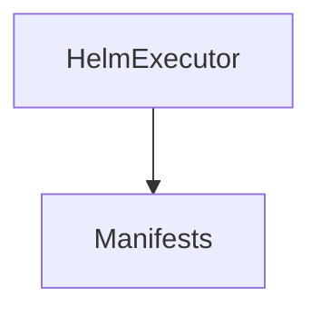
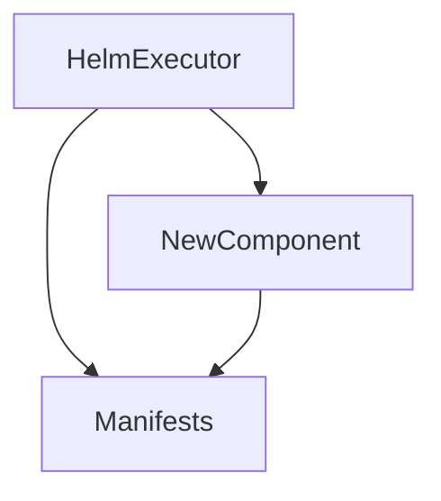

# Documentation Automation and Maintenance

## Overview

This document describes how to maintain and update the architecture documentation for Helm Test Java.

## Documentation Structure

```
docs/architecture/
├── ARCHITECTURE.md       # System context and overview
├── COMPONENTS.md         # Component architecture
├── DATA.md              # Data flow and models
├── SECURITY.md          # Security architecture
├── QUALITY.md           # Quality attributes
├── MAINTENANCE.md       # This file
└── adr/                 # Architecture Decision Records
    ├── README.md
    ├── 0001-*.md
    └── ...
```

## Documentation Principles

1. **Living Documentation**: Keep docs synchronized with code
2. **Mermaid Diagrams**: Use code-based diagrams (GitHub renders them)
3. **Markdown Format**: All docs in Markdown for GitHub compatibility
4. **Linked Navigation**: Cross-link related documents
5. **Version Control**: Track doc changes in git

## Maintenance Responsibilities

### When to Update Documentation

| Change Type | Documents to Update | Trigger |
|-------------|---------------------|---------|
| New public API | COMPONENTS.md | Before merge |
| New dependency | ARCHITECTURE.md, COMPONENTS.md | Before merge |
| Architecture decision | Create new ADR | During design |
| Security change | SECURITY.md | Before release |
| Performance impact | QUALITY.md | After measurement |
| New module | ARCHITECTURE.md, COMPONENTS.md | Before merge |
| Breaking change | All relevant docs + Migration guide | Before release |

### Update Checklist

Before releasing a new version:

- [ ] Review all architecture docs for accuracy
- [ ] Update version numbers in examples
- [ ] Check all diagrams render correctly on GitHub
- [ ] Verify all internal links work
- [ ] Add ADR if significant decision made
- [ ] Update quality metrics if measured
- [ ] Review security considerations for new code

## Diagram Maintenance

### Mermaid Diagrams

**Advantages**:
- Renders natively in GitHub Markdown
- Version controlled as text
- Easy to update
- Consistent styling

**Syntax Check**:
```bash
# Use Mermaid CLI to validate
npm install -g @mermaid-js/mermaid-cli
mmdc -i diagram.mmd -o diagram.png
```

**Common Diagram Types Used**:

1. **C4 Context Diagrams**: System boundaries
2. **Flowcharts**: Data flow and processes
3. **Sequence Diagrams**: Component interactions
4. **State Diagrams**: Data lifecycle
5. **Graph Diagrams**: Module relationships

**Example Update**:
```markdown
<!-- Before: Adding new component -->


<!-- After: Adding new component -->

```

### Diagram Conventions

- **Blue boxes**: Internal components
- **Red boxes**: External systems
- **Green boxes**: User-facing elements
- **Arrows**: Data/control flow direction
- **Dotted lines**: Optional or conditional relationships

## ADR Maintenance

### When to Create an ADR

Create an ADR when making decisions about:
- Architecture patterns
- Technology choices
- API design
- Security approaches
- Performance tradeoffs
- Significant refactoring

### ADR Workflow

1. **Propose**: Create ADR with status "Proposed"
2. **Discuss**: Review with team/community
3. **Decide**: Update status to "Accepted" or "Rejected"
4. **Implement**: Make the change
5. **Update**: If reversed, mark "Superseded" and link to new ADR

### ADR Numbering

- Sequential: 0001, 0002, 0003, ...
- Never reuse numbers
- Include number in filename: `NNNN-title.md`

### Superseding an ADR

```markdown
# ADR 0007: New Approach

## Status

Accepted (Supersedes ADR-0003)

## Context

ADR-0003 chose approach X, but we've learned...

## Decision

Use approach Y instead...
```

Update old ADR:
```markdown
# ADR 0003: Old Approach

## Status

Superseded by ADR-0007

...
```

## Automated Documentation

### Generating API Documentation

While this architecture documentation is manually maintained, API documentation can be generated:

```bash
# Generate Javadoc
./gradlew javadoc

# Output: library/build/docs/javadoc/index.html
```

**Publishing Javadoc**:
- Automatically published to Maven Central with releases
- Available at: https://javadoc.io/doc/com.rrmoore/helm-test-java

### Dependency Graphs

Generate dependency graphs for documentation:

```bash
# Project dependency report
./gradlew dependencies > dependencies.txt

# Graphical dependency tree
./gradlew dependencyInsight --dependency kubernetes-client
```

### Test Coverage Reports

Include coverage metrics in QUALITY.md:

```bash
# Generate coverage report
./gradlew test jacocoTestReport

# Output: library/build/reports/jacoco/test/html/index.html
```

Update QUALITY.md with latest metrics:
```markdown
### Test Coverage

**Library Module**: 87% line coverage (Updated: 2025-01-20)
```

## Documentation Validation

### Markdown Linting

Use markdownlint to ensure consistent formatting:

```bash
# Install markdownlint
npm install -g markdownlint-cli

# Lint all markdown
markdownlint docs/**/*.md
```

### Link Checking

Verify internal links work:

```bash
# Install markdown-link-check
npm install -g markdown-link-check

# Check links
markdown-link-check docs/architecture/ARCHITECTURE.md
```

### Mermaid Validation

Ensure diagrams render:

```bash
# Render to verify syntax
mmdc -i docs/architecture/ARCHITECTURE.md
```

## Documentation Review Process

### Before Merging PR

1. **Author Responsibility**:
   - Update affected documentation
   - Add ADR if architectural decision made
   - Update diagrams if component relationships changed
   - Run markdown linter

2. **Reviewer Responsibility**:
   - Verify docs match code changes
   - Check diagrams render correctly
   - Ensure ADRs have proper rationale
   - Validate examples still work

### Periodic Reviews

**Quarterly** (or each release):
- Review all architecture docs for accuracy
- Update quality metrics
- Check for broken links
- Update dependency versions in examples
- Refresh screenshots if any exist

**Annually**:
- Major documentation audit
- Reorganize if structure became unwieldy
- Archive superseded ADRs
- Update all diagrams for consistency

## Documentation Tools

### Recommended Tools

| Tool | Purpose | Installation |
|------|---------|-------------|
| markdownlint | Markdown linting | `npm install -g markdownlint-cli` |
| markdown-link-check | Link validation | `npm install -g markdown-link-check` |
| mermaid-cli | Diagram validation | `npm install -g @mermaid-js/mermaid-cli` |
| Vale | Prose linting | `brew install vale` |

### Editor Plugins

**VS Code**:
- Markdown All in One
- Markdown Preview Mermaid Support
- markdownlint
- Code Spell Checker

**IntelliJ IDEA**:
- Markdown plugin (built-in)
- Mermaid plugin
- Grazie (grammar checking)

## Documentation Templates

### New Component Documentation Template

```markdown
### ComponentName

**File**: [path/to/ComponentName.java](../../path/to/ComponentName.java)

**Purpose**: Brief description of what this component does.

**Responsibilities**:
- Responsibility 1
- Responsibility 2

**Key Methods**:
```java
public ReturnType methodName(ParamType param)
```

**Design Patterns**:
- Pattern Name: Why it's used

**Dependencies**:
- Dependency 1
- Dependency 2
```

### New ADR Template

See [adr/README.md](adr/README.md) for the ADR template.

## GitHub Integration

### Linking from README

The main README should link to architecture docs:

```markdown
## Documentation

- [Architecture Documentation](docs/architecture/ARCHITECTURE.md)
- [API Documentation](https://javadoc.io/doc/com.rrmoore/helm-test-java)
```

### GitHub Wiki

**Decision**: Do NOT use GitHub wiki
**Rationale**: Wiki not version controlled with code, harder to keep in sync
**Alternative**: Keep all docs in `docs/` directory

### GitHub Pages

**Optional Enhancement**: Publish docs to GitHub Pages

```bash
# Setup (one-time)
# 1. Create gh-pages branch
git checkout --orphan gh-pages

# 2. Configure GitHub Pages in repository settings
# Settings → Pages → Source: gh-pages branch

# 3. Add docs build to CI
# (Future enhancement)
```

## Versioning Documentation

### Documentation Versioning Strategy

**Current Approach**: Single version (main branch)

**For Multi-Version Support**:
```
docs/
├── current/           # Latest version
├── v1.0/             # Version 1.0 docs
└── v2.0/             # Version 2.0 docs
```

**When to Version**:
- Major version releases with breaking changes
- Significant architecture redesigns

## Continuous Improvement

### Documentation Debt

Track documentation TODOs in issues:

```markdown
<!-- In documentation -->
<!-- TODO: Add sequence diagram for error handling (Issue #123) -->
```

### Feedback Loop

Encourage documentation improvements:
- "Improve documentation" label on issues
- Documentation contributions welcome
- Update docs based on user questions

### Metrics to Track

- Documentation coverage (% of public APIs documented)
- Time since last update
- Number of broken links
- User feedback on clarity

## Ownership

| Document | Owner | Review Frequency |
|----------|-------|------------------|
| ARCHITECTURE.md | Core maintainer | Each release |
| COMPONENTS.md | Core maintainer | Each release |
| DATA.md | Core maintainer | Each release |
| SECURITY.md | Security lead | Each release |
| QUALITY.md | Quality lead | Each release |
| ADRs | Decision authors | As needed |

## Getting Help

**Questions about documentation**:
- Open GitHub issue with "documentation" label
- Tag @maintainers in PR comments

**Suggesting improvements**:
- Open issue describing improvement
- Submit PR with documentation updates

## Resources

- [Mermaid Documentation](https://mermaid-js.github.io/)
- [ADR GitHub Organization](https://adr.github.io/)
- [C4 Model](https://c4model.com/)
- [Markdown Guide](https://www.markdownguide.org/)
- [Javadoc Style Guide](https://www.oracle.com/technical-resources/articles/java/javadoc-tool.html)
