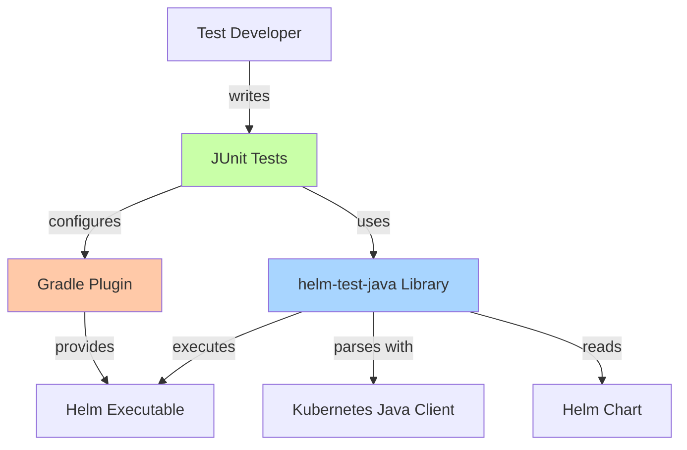

# Helm Test Java - Architecture Documentation

Welcome to the architecture documentation for Helm Test Java, a Java library and Gradle plugin for writing automated tests for Helm charts.

## Documentation Overview

This documentation provides a comprehensive view of the system's architecture, design decisions, and quality attributes.

### Core Documents

| Document | Description |
|----------|-------------|
| [ARCHITECTURE.md](ARCHITECTURE.md) | System context, module architecture, and integration points |
| [COMPONENTS.md](COMPONENTS.md) | Detailed component structure and interactions |
| [DATA.md](DATA.md) | Data models, flow, and processing patterns |
| [SECURITY.md](SECURITY.md) | Security architecture and best practices |
| [QUALITY.md](QUALITY.md) | Performance, reliability, and maintainability characteristics |
| [MAINTENANCE.md](MAINTENANCE.md) | Documentation maintenance and automation guidelines |

### Architecture Decision Records

[ADR Directory](adr/README.md) contains records of significant architectural decisions:

- [ADR-0001: Use Process Execution for Helm CLI Interaction](adr/0001-use-process-execution-for-helm-cli.md)
- [ADR-0002: Use Temporary Files for Values YAML](adr/0002-use-temporary-files-for-values-yaml.md)
- [ADR-0003: Use Kubernetes Java Client for Manifest Parsing](adr/0003-use-kubernetes-java-client-for-manifest-parsing.md)
- [ADR-0004: Create Gradle Plugin for Helm Toolchain Management](adr/0004-create-gradle-plugin-for-helm-toolchain.md)
- [ADR-0005: Provide Decorator Pattern for Custom Manifest Access](adr/0005-provide-decorator-pattern-for-custom-manifest-access.md)
- [ADR-0006: Target Java 25 as Minimum Version](adr/0006-target-java-25.md)

## Quick Start

If you're new to the architecture, read documents in this order:

1. **[ARCHITECTURE.md](ARCHITECTURE.md)** - Get the big picture
2. **[COMPONENTS.md](COMPONENTS.md)** - Understand the main components
3. **[ADR Index](adr/README.md)** - Learn why key decisions were made
4. **[DATA.md](DATA.md)** - See how data flows through the system
5. **[SECURITY.md](SECURITY.md)** - Understand security considerations
6. **[QUALITY.md](QUALITY.md)** - Learn about quality characteristics

## Key Architectural Patterns

### System Architecture



### Core Patterns

1. **Facade Pattern**: `HelmExecutor` simplifies Helm CLI interaction
2. **Value Object**: `Manifests` encapsulates parsed resources
3. **Decorator Pattern**: Users extend `Manifests` for chart-specific access
4. **Provider Pattern**: Gradle plugin uses lazy configuration

## System Boundaries

### What Helm Test Java Does

- ✅ Execute `helm template` commands
- ✅ Parse rendered Kubernetes manifests
- ✅ Provide type-safe manifest access
- ✅ Manage Helm executable versions
- ✅ Support multiple values file combinations

### What It Does NOT Do

- ❌ Deploy to Kubernetes clusters
- ❌ Perform actual Helm installs/upgrades
- ❌ Manage Kubernetes cluster connections
- ❌ Validate chart syntax (delegates to Helm)
- ❌ Test runtime behavior of deployed applications

## Technology Stack

| Layer | Technology | Version |
|-------|-----------|---------|
| Language | Java | 25 |
| Build Tool | Gradle | 8+ |
| Testing Framework | JUnit Jupiter | 5+ |
| Kubernetes Models | Kubernetes Java Client | 25.0.0 |
| Plugin Language | Kotlin | Latest |

## Module Structure

```
helm-test-java/
├── library/                    # Core testing library
│   └── src/main/java/
│       └── com/rrmoore/helm/test/
│           ├── HelmExecutor.java
│           ├── Manifests.java
│           └── jdkext/
│               └── Exceptions.java
│
├── gradle/plugins/            # Gradle plugin for toolchain
│   └── gradle-plugin/
│       └── src/main/kotlin/
│           └── com/rrmoore/gradle/helm/test/
│               ├── HelmTestJavaPlugin.kt
│               ├── HelmToolchainExtension.kt
│               └── ...
│
└── example/                   # Example usage
    └── src/
        ├── main/helm/         # Example chart
        └── test/java/         # Example tests
```

## For Different Audiences

### For Users

- **Getting Started**: See [main README](../../README.md)
- **API Documentation**: [Javadoc](https://javadoc.io/doc/com.rrmoore/helm-test-java)
- **Security Best Practices**: [SECURITY.md](SECURITY.md)
- **Quality Characteristics**: [QUALITY.md](QUALITY.md)

### For Contributors

- **Architecture Overview**: [ARCHITECTURE.md](ARCHITECTURE.md)
- **Component Details**: [COMPONENTS.md](COMPONENTS.md)
- **Design Decisions**: [ADR Directory](adr/README.md)
- **Documentation Maintenance**: [MAINTENANCE.md](MAINTENANCE.md)

### For Architects

- **System Context**: [ARCHITECTURE.md](ARCHITECTURE.md)
- **Architecture Decisions**: [ADR Directory](adr/README.md)
- **Quality Attributes**: [QUALITY.md](QUALITY.md)
- **Security Architecture**: [SECURITY.md](SECURITY.md)

### For Security Reviewers

- **Security Architecture**: [SECURITY.md](SECURITY.md)
- **Process Execution**: [ADR-0001](adr/0001-use-process-execution-for-helm-cli.md)
- **Dependency Management**: [ARCHITECTURE.md](ARCHITECTURE.md)
- **Data Handling**: [DATA.md](DATA.md)

## Documentation Principles

This documentation follows these principles:

1. **Living Documentation**: Updated with code changes
2. **Diagram as Code**: Mermaid diagrams in Markdown
3. **Decision Records**: Architectural decisions documented as ADRs
4. **Multiple Views**: Context, component, data, security, quality views
5. **Audience-Specific**: Tailored to different stakeholder needs

## Navigation Tips

### Finding Information

**"How does it work?"** → [ARCHITECTURE.md](ARCHITECTURE.md)

**"How is it structured?"** → [COMPONENTS.md](COMPONENTS.md)

**"Why was it designed this way?"** → [ADR Directory](adr/README.md)

**"How does data flow?"** → [DATA.md](DATA.md)

**"Is it secure?"** → [SECURITY.md](SECURITY.md)

**"How well does it perform?"** → [QUALITY.md](QUALITY.md)

**"How do I maintain docs?"** → [MAINTENANCE.md](MAINTENANCE.md)

### Cross-References

Documents are extensively cross-linked:
- Component descriptions link to source files
- ADRs reference related decisions
- Security considerations link to relevant components
- Quality attributes reference architectural patterns

## Keeping Up to Date

**Last Updated**: 2025-01-20

**Review Frequency**: Every release

**Maintenance Guidelines**: See [MAINTENANCE.md](MAINTENANCE.md)

## Contributing to Documentation

Documentation contributions are welcome! See [MAINTENANCE.md](MAINTENANCE.md) for:
- When to update documentation
- How to create ADRs
- Documentation style guide
- Review process

## Feedback

Found an issue with the documentation?
- Open a GitHub issue with the "documentation" label
- Submit a PR with corrections
- Ask questions in discussions

## License

Documentation is part of Helm Test Java and licensed under Apache 2.0.
